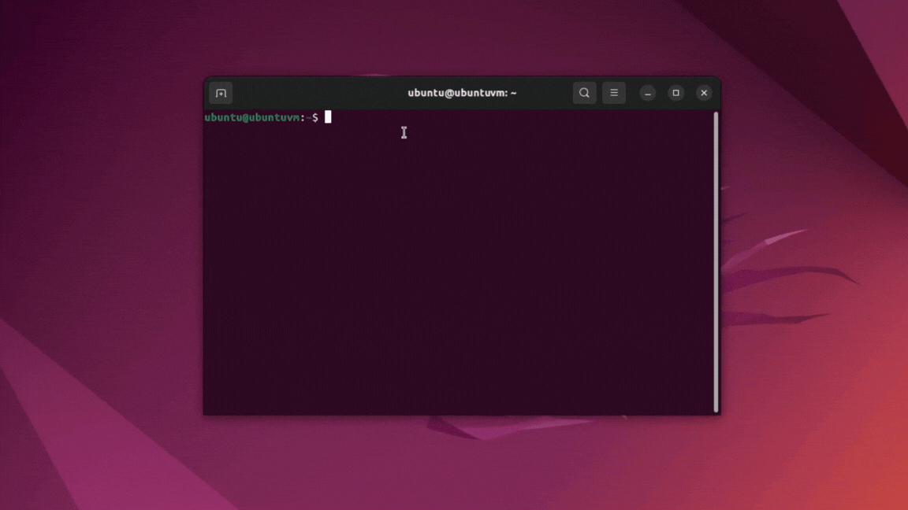

# whichDOS

Script to detect the possible operating system of the target through its TTL.

[](https://www.python.org)

### README language

- 🇪🇸 [Spanish](./README-es.md)
- 🇺🇸 **English**



## Installation

1. Clone the repository on your system.
   ```bash
   git clone https://github.com/Qv1ko/whichDOS.git
   ```
2. Go inside the whichDOS directory.
   ```bash
   cd whichDOS
   ```
3. Give run permissions to the script.
   ```bash
   chmod +x whichDOS.py
   ```
4. Copy the whichDOS.py file to an absolute path on your system.
   ```bash
   cp whichDOS.py /usr/bin/
   ```

## Usage

To use the script, run the following command in the console.

```bash
whichDOS.py {target ip}
```

## Author

- Marcelo Vázquez ([s4vitar](https://github.com/s4vitar))
